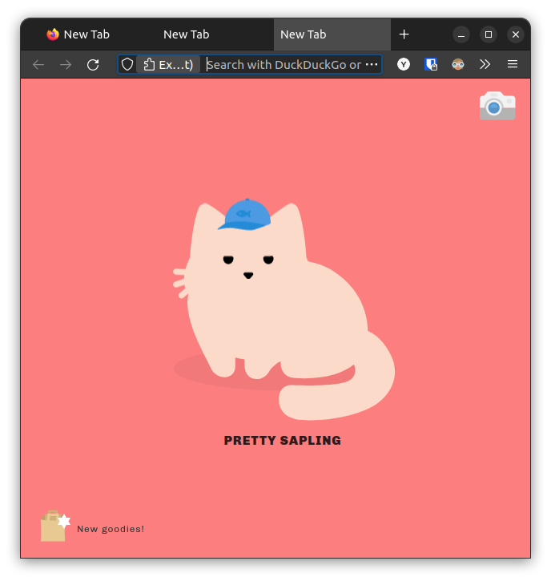

## Firefox to Chrome Style
I hate proton tab style.<br>
I use WaveFox https://github.com/QNetITQ/WaveFox.

<p align="center">
    
</p>


## Neovim
Default color scheme is enough for developing.
<p align="center">
    
</p>

## Useful shortcut
1. select python code in visual mode -> press `\p` -> execute the selected codes
2. press `\p` -> relatively execute($python -m x.y.z) current whole python file
3. press `\g+` -> compile current cpp code and execute the binary(vimpp.out)
4. press `\gc` -> compile current c code and execute the binary(vimc.out)
5. press `\fp` -> format python code
5. press `\fc` -> format c/c++ code
6. press `\ss` -> toggle nu & rnu


## Install Neovim
```bash
    $ sudo apt-get install ninja-build gettext libtool libtool-bin autoconf automake cmake g++ pkg-config unzip curl doxygen
    $ git clone https://github.com/neovim/neovim.git
    $ cd neovim && sudo make -j16 CMAKE_BUILD_TYPE=Release && sudo make CMAKE_BUILD_TYPE=Release install
```

## Install configuration
```bash
    $ git clone git@github.com:youngtuotuo/dotfiles.git
    $ cd dotfiles && cp ./nvim ~/.config/
```

## Install python formatter
```bash
    $ pip install black
```
## Install bash formatter
```bash
    $ sudo apt install shfmt
```

## Install Plugin manager
```bash
    $ sh -c 'curl -fLo "${XDG_DATA_HOME:-$HOME/.local/share}"/nvim/site/autoload/plug.vim --create-dirs \
       https://raw.githubusercontent.com/junegunn/vim-plug/master/plug.vim'
    $ nvim +PlugInstall +TSInstallSync
```


## Install pyright
```bash
    $ sudo apt install nodejs
    $ sudo npm -g install pyright
```
### cv2 typing issue
Remember to chage `target env name` and `python3.x` to suitable case.
```bash
    $ conda activate <target env name>
    $ cd dotfiles
    $ cp cv2/__init__.pyi $CONDA_PREFIX/lib/<python3.x>/site-packages/cv2/__init__.pyi
```


## Install ccls
[Details](https://github.com/MaskRay/ccls/wiki/Build)<br>
Ubuntu 2204
```bash
    $ sudo apt-get install clang clang-dev
    $ git clone --depth=1 --recursive https://github.com/MaskRay/ccls && cd ccls
    $ cmake -H. -BRelease -DCMAKE_BUILD_TYPE=Release \
    -DCMAKE_PREFIX_PATH=/usr/lib/llvm-14 \
    -DLLVM_INCLUDE_DIR=/usr/lib/llvm-14/include \
    -DLLVM_BUILD_INCLUDE_DIR=/usr/include/llvm-14/
    $ cd Release
    $ sudo make install
    $ cd Release
```

