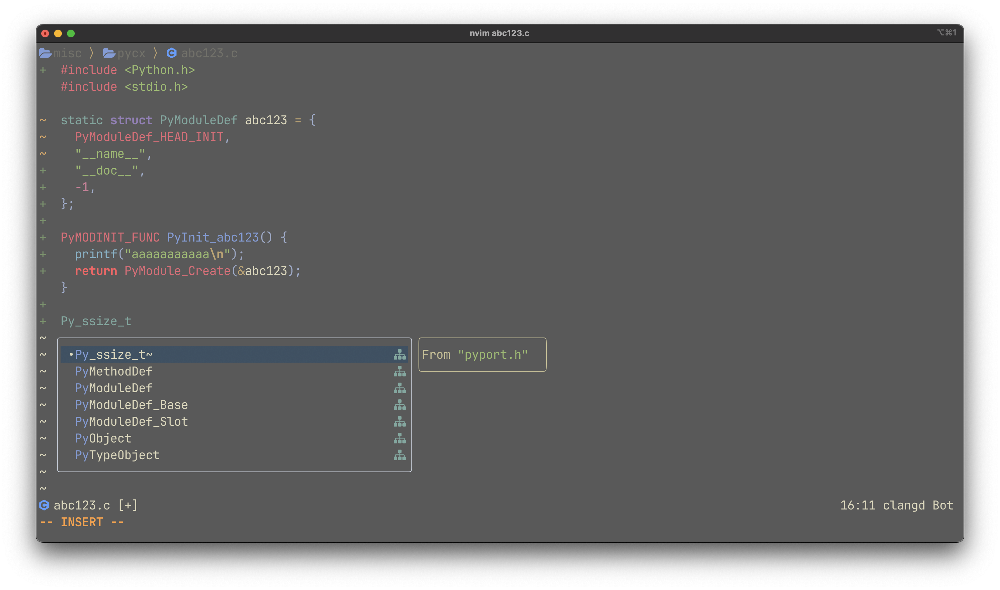
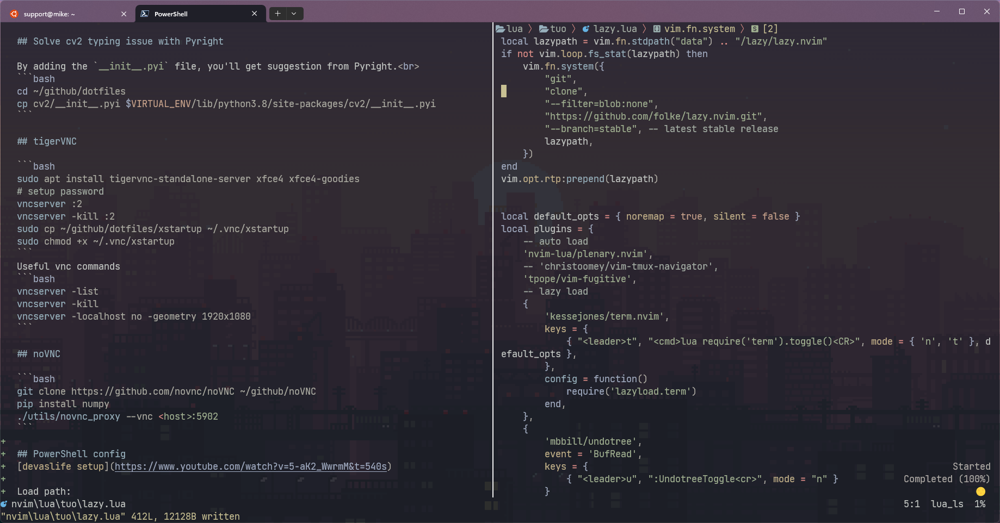

# Dotfiles
My routine data science envrionment set up in ubuntu/mac/windows.<br>


# Mac/Ubuntu
<p align="center">
    
</p>


<summary><font size="4"><b>Gnome-Tweaks and Dconf-Editor</b></font></summary>

```bash
# Use `Tweaks` app to change caps to ctrl.
sudo apt install gnome-tweaks -y
# Use `dconf-editor` to change click app action be 'minimize-and-preview'. (org/gnome/shell/extensions/dash-to-dock/click-action)
sudo apt install dconf-editor -y
# (Optional) Disable laptop keybard
xinput disable "AT Translated Set 2 keyboard"
```


<summary><font size="4"><b>Clipboard Indicator</b></font></summary>

Ubuntu

[https://extensions.gnome.org/extension/779/clipboard-indicator/](https://extensions.gnome.org/extension/779/clipboard-indicator/)

Mac

[https://apps.apple.com/us/app/copyclip-clipboard-history/id595191960?mt=12](https://apps.apple.com/us/app/copyclip-clipboard-history/id595191960?mt=12)

<summary><font size="4"><b>Fira Code Nerd Font</b></font></summary>
    
[https://github.com/ryanoasis/nerd-fonts/releases](https://github.com/ryanoasis/nerd-fonts/releases)

<summary><font size="4"><b>Git-Credential-Manager</b></font></summary>

[https://github.com/GitCredentialManager/git-credential-manager/releases](https://github.com/GitCredentialManager/git-credential-manager/releases)
```bash
sudo dpkg -i <path-to-package>
git-credential-manager configure
```

<summary><font size="4"><b>Cuda</b></font></summary>

[https://docs.nvidia.com/cuda/cuda-installation-guide-linux/index.html](https://docs.nvidia.com/cuda/cuda-installation-guide-linux/index.html)<br>

```bash
sudo apt-get install linux-headers-$(uname -r)
# WARNING: the `ubuntu2004/x86_64` in the following url may be different, remember to change it.
# you can find the feasible choices here https://docs.nvidia.com/cuda/cuda-installation-guide-linux/index.html#network-repo-installation-for-ubuntu
wget https://developer.download.nvidia.com/compute/cuda/repos/ubuntu2004/x86_64/cuda-keyring_1.0-1_all.deb
sudo dpkg -i cuda-keyring_1.0-1_all.deb
sudo apt-get update
sudo apt-get install cuda -y
```

<summary><font size="4"><b>Neovim</b></font></summary>
  
Ubuntu
```bash
# Install Dependicies
sudo apt-get install ninja-build gettext libtool libtool-bin autoconf automake cmake g++ pkg-config unzip curl doxygen -y

# Build from Source
git clone https://github.com/neovim/neovim.git
cd neovim
sudo make -j$(nproc) CMAKE_BUILD_TYPE=Release && sudo make CMAKE_BUILD_TYPE=Release install
```

Mac (homebrew)
  
```bash
/bin/bash -c "$(curl -fsSL https://raw.githubusercontent.com/Homebrew/install/HEAD/install.sh)"
brew install --HEAD neovim
```
  
Both
```bash
# Install Plugin Manager
git clone --depth 1 https://github.com/wbthomason/packer.nvim ~/.local/share/nvim/site/pack/packer/start/packer.nvim

# Install Configuration
git clone git@github.com:youngtuotuo/dotfiles.git ~/github/dotfiles
ln -s ~/github/dotfiles/nvim/ ~/.config/nvim

# Run the following command to install LSP, formatter, etc.
nvim --headless -c 'autocmd User PackerComplete quitall' -c 'PackerSync'
```
#### Neovim Shortcut
1. Select python code and press `\p` -> execute the selected codes
2. Press `\p`  -> execute current file
    - Currently support python, c, cpp


<summary><font size="4"><b>Latex Compiler</b></font></summary>

```bash
sudo apt install texlive-latex-base texlive-fonts-recommended texlive-fonts-extra texlive-latex-extra texlive-xetex latexmk -y
```

<summary><font size="4"><b>Okular PDF viewer for VimTex</b></font></summary>

[https://binary-factory.kde.org/job/Okular_Release_macos/](https://binary-factory.kde.org/job/Okular_Release_macos/)


<summary><font size="4"><b>Rust (cargo, rustup)</b></font></summary>

```bash
curl --proto '=https' --tlsv1.2 -sSf https://sh.rustup.rs | sh
source "$HOME/.cargo/env"
```

<summary><font size="4"><b>Solve cv2 typing issue with Pyright</b></font></summary>

By adding the `__init__.pyi` file, you'll get suggestion from Pyright.<br>
```bash
cd ~/github/dotfiles
cp cv2/__init__.pyi $VIRTUAL_ENV/lib/python3.8/site-packages/cv2/__init__.pyi
```

<summary><font size="4"><b>RayCast, noVNC, tigerVNC, OpenVPN Connect, VLC, Stats, AltTab, Rectangle, Tmux</b></font></summary>

    TBD

#### Tmux Shortcut
1. `<c-\>>` move current window right
2. `<c-\><` move current window right
3. `<c-\>\` horizontal split
3. `<c-\>|` vertical split

# Windows
<p align="center">
    
</p>

<summary><font size="4"><b>Scoop</b></font></summary>

```powershell
Set-ExecutionPolicy RemoteSigned -Scope CurrentUser # Optional: Needed to run a remote script the first time
irm get.scoop.sh | iex
```


<summary><font size="4"><b>Neovim</b></font></summary>

```powershell
# TODO: Other commands
scoop install neovim
```
