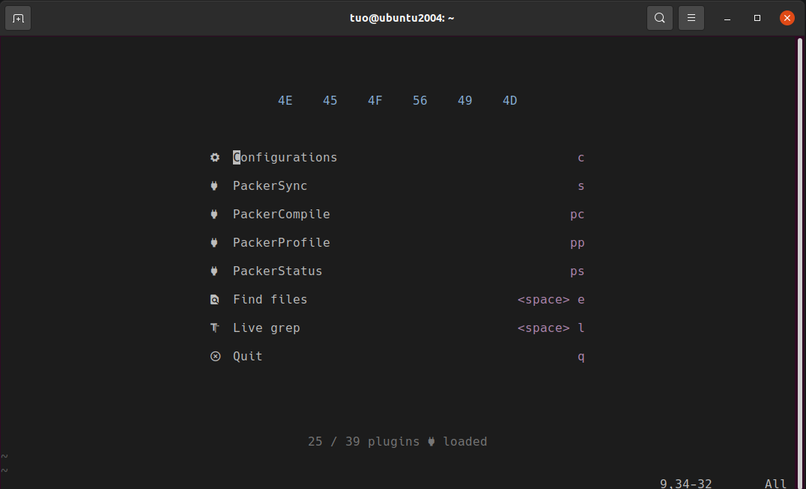

# Neovim
<p align="center">
    
</p>

## Useful shortcut
1. select python code and press `\p` -> execute the selected codes
2. press `\p` -> relatively execute($python -m x.y.z) current whole python file
3. press `\g+` -> compile current cpp code and execute the binary(vimpp.out)
4. press `\gc` -> compile current c code and execute the binary(vimc.out)
6. press `\ss` -> toggle nu & rnu
7. press `\ts` -> toggle treesitter highlight


## Install Neovim Nightly Build
```bash
    $ sudo apt-get install ninja-build gettext libtool libtool-bin autoconf automake cmake g++ pkg-config unzip curl doxygen
    $ git clone https://github.com/neovim/neovim.git
    $ cd neovim && sudo make -j$(nproc) CMAKE_BUILD_TYPE=Release && sudo make CMAKE_BUILD_TYPE=Release install
```

## Install Plugin manager Packer.nvim
Linux/Mac
```bash
    $ git clone --depth 1 https://github.com/wbthomason/packer.nvim\
 ~/.local/share/nvim/site/pack/packer/start/packer.nvim
```
Windows
```powershell
    $ git clone https://github.com/wbthomason/packer.nvim "$env:LOCALAPPDATA\nvim-data\site\pack\packer\start\packer.nvim"```
```

## Install Neovim configuration
```bash
    $ git clone git@github.com:youngtuotuo/dotfiles.git ~/github/dotfiles
```

### Link config folder

Linux/Mac
```bash
    $ ln -s ~/github/dotfiles/nvim/ ~/.config/nvim
```

Windows
```powershell
    $ New-Item -ItemType SymbolicLink -Path "~/AppData/Local/nvim" -Target "~/projects/dotfiles/nvim"
```

## Intsall Latex Compiler
```bash
    $ sudo apt install texlive-latex-base texlive-fonts-recommended texlive-fonts-extra texlive-latex-extra texlive-xetex latexmk
```

## Install Pdf viewr for VimTex
```bash
    $ sudo apt install zathura
```

## Install Rust
```bash
    $ curl --proto '=https' --tlsv1.2 -sSf https://sh.rustup.rs | sh
    $ source "$HOME/.cargo/env"
```

## Install Latex LSP - Texlab

```bash
    $ cargo install texlab
```

## Install Python LSP - Python Language Server
```bash
    $ pip install "python-lsp-server[all]"
```

## Install C/C++ LSP - clangd
```bash
    $ sudo apt install clangd-12
```

## cv2 typing issue
Remember to chage `target env name` and `python3.x` to suitable case.
```bash
    $ conda activate <target env name>
    $ cd dotfiles
    $ cp cv2/__init__.pyi $CONDA_PREFIX/lib/<python3.x>/site-packages/cv2/__init__.pyi
```

## TODO
Ubuntu setup
- [ ] Auto setup bash script
- [ ] Rust Analyzer Setup

Windows setup
- [ ] Auto setup powershell script
- [ ] Rust Analyzer Setup

MacOS setup
- [ ] Auto setup shell script
