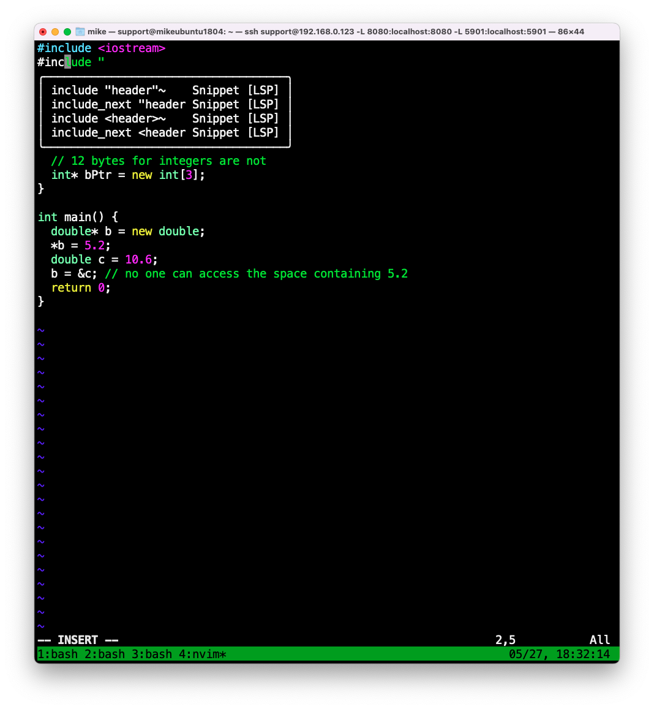

## Neovim
Default color scheme is enough for developing.
<p align="center">
    
</p>

## Useful shortcut
1. select python code in visual mode -> press `\p` -> execute the selected codes
1. press `\p` -> relatively execute($python -m x.y.z) current whole python file
2. press `\g+` -> compile current cpp code and execute the binary(vimpp.out)
2. press `\gc` -> compile current c code and execute the binary(vimc.out)


## Install Neovim
```bash
    $ sudo apt-get install ninja-build gettext libtool libtool-bin autoconf automake cmake g++ pkg-config unzip curl doxygen
    $ git clone https://github.com/neovim/neovim.git
    $ cd neovim && sudo make -j16 CMAKE_BUILD_TYPE=Release && sudo make CMAKE_BUILD_TYPE=Release install
```

## Install configuration
```bash
    $ git clone git@github.com:youngtuotuo/dotfiles.git
    $ cd dotfiles && cp ./nvim ~/.confg/
```

## Install Plugin manager
```bash
    $ sh -c 'curl -fLo "${XDG_DATA_HOME:-$HOME/.local/share}"/nvim/site/autoload/plug.vim --create-dirs \
       https://raw.githubusercontent.com/junegunn/vim-plug/master/plug.vim'
    $ nvim -u NONE
    :Plugsinstall
    :TSInstallSync
```


## Install pyright, vimls, bashls, yamlls
```bash
    $ curl -sL https://deb.nodesource.com/setup_12.x | sudo -E bash -
    $ sudo apt install nodejs
    $ sudo npm -g install vim-language-server
    $ sudo npm -g install pyright
    $ sudo npm -g install bash-language-server
    $ sudo npm install -g yarn
    $ sudo yarn global add yaml-language-server
```

## Install ccls
[Details](https://github.com/MaskRay/ccls/wiki/Build)
```bash
    $ git clone --depth=1 --recursive https://github.com/MaskRay/ccls
    $ cd ccls
    $ wget -c http://releases.llvm.org/8.0.0/clang+llvm-8.0.0-x86_64-linux-gnu-ubuntu-18.04.tar.xz
    $ tar xf clang+llvm-8.0.0-x86_64-linux-gnu-ubuntu-18.04.tar.xz
    $ cmake -H. -BRelease -DCMAKE_BUILD_TYPE=Release -DCMAKE_PREFIX_PATH=$PWD/clang+llvm-8.0.0-x86_64-linux-gnu-ubuntu-18.04
    $ cmake --build Release
    $ cd Release
    $ sudo make install
```

