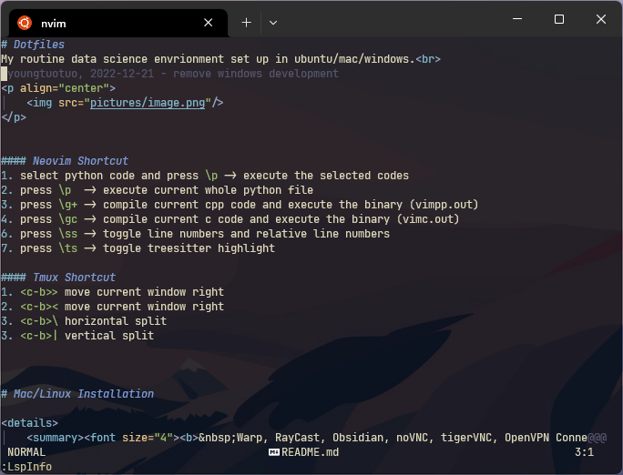

# Dotfiles
My routine data science envrionment set up in ubuntu/mac.<br>

<p align="center">
    
</p>

- Dev
    - Alacritty (Fira Code Nerd Font)
    - Nushell
    - Neovim
    - Tmux
    - python venv
    - Latex
    - Texlab, Pyright, Clangd, Rust Analyzer, Sumneko Lua
- Ops
    - Slack
    - Chromium
    - Git Credential Manager
    - Docker
    - TigerVNC
- ML
    - CVAT
    - Pytorch
    - Cuda
    - Numpy


#### Neovim Shortcut
1. select python code and press `\p` -> execute the selected codes
2. press `\p`  -> execute current whole python file
3. press `\g+` -> compile current cpp code and execute the binary (vimpp.out)
4. press `\gc` -> compile current c code and execute the binary (vimc.out)
6. press `\ss` -> toggle line numbers and relative line numbers
7. press `\ts` -> toggle treesitter highlight

#### Tmux Shortcut
1. `<c-b>>` move current window right
2. `<c-b><` move current window right
3. `<c-b>\` horizontal split
3. `<c-b>|` vertical split


# Installation

```bash
    sudo apt-get update
    sudo apt-get upgrade -y
    sudo apt install openssh-server build-essential git tmux -y
    sudo apt install gnome-tweaks -y
    sudo apt install dconf-editor -y
```

1. Use `Tweaks` app to change caps to ctrl.
2. Use `dconf-editor` to change click app action be 'minimize-and-preview'.
    (org/gnome/shell/extensions/dash-to-dock/click-action)
3. (Optional) Disable laptop keybard: `xinput disable "AT Translated Set 2 keyboard"`


Clipboard Indicator<br>
[https://extensions.gnome.org/extension/779/clipboard-indicator/](https://extensions.gnome.org/extension/779/clipboard-indicator/)

Alacritty<br>
[https://github.com/alacritty/alacritty/blob/master/INSTALL.md](https://github.com/alacritty/alacritty/blob/master/INSTALL.md)

Fira Code Nerd Font<br>
[https://github.com/ryanoasis/nerd-fonts/releases](https://github.com/ryanoasis/nerd-fonts/releases)

Docker and CVAT<br>
[https://opencv.github.io/cvat/docs/administration/basics/installation/](https://opencv.github.io/cvat/docs/administration/basics/installation/)

Git-Credential-Manager<br>
[https://github.com/GitCredentialManager/git-credential-manager/releases](https://github.com/GitCredentialManager/git-credential-manager/releases)
```bash
    sudo dpkg -i <path-to-package>
    git-credential-manager configure
```

Install Cuda<br>
[https://docs.nvidia.com/cuda/cuda-installation-guide-linux/index.html](https://docs.nvidia.com/cuda/cuda-installation-guide-linux/index.html)<br>
WARNING: the `ubuntu2004/x86_64` in the url may be different, remember to change it.

```bash
    sudo apt-get install linux-headers-$(uname -r)
    wget https://developer.download.nvidia.com/compute/cuda/repos/ubuntu2004/x86_64/cuda-keyring_1.0-1_all.deb
    sudo dpkg -i cuda-keyring_1.0-1_all.deb
    sudo apt-get update
    sudo apt-get install cuda -y
```

#### Install Neovim

Ubuntu

Install Dependicies
```bash
    sudo apt-get install ninja-build gettext libtool libtool-bin autoconf automake cmake g++ pkg-config unzip curl doxygen -y
```

Build from Source
```bash
    git clone https://github.com/neovim/neovim.git
    cd neovim
    sudo make -j$(nproc) CMAKE_BUILD_TYPE=Release && sudo make CMAKE_BUILD_TYPE=Release install
```

Mac (homebrew)

```bash
    /bin/bash -c "$(curl -fsSL https://raw.githubusercontent.com/Homebrew/install/HEAD/install.sh)"
    brew install --HEAD neovim
```

Install Plugin Manager

```bash
    git clone --depth 1 https://github.com/wbthomason/packer.nvim ~/.local/share/nvim/site/pack/packer/start/packer.nvim
```

Install Configuration

```bash
    git clone git@github.com:youngtuotuo/dotfiles.git ~/github/dotfiles
    ln -s ~/github/dotfiles/nvim/ ~/.config/nvim
```

Run the following command
```bash
    nvim --headless -c 'autocmd User PackerComplete quitall' -c 'PackerSync'
```


#### Intsall Latex Compiler

```bash
    sudo apt install texlive-latex-base texlive-fonts-recommended texlive-fonts-extra texlive-latex-extra texlive-xetex latexmk -y
```

#### Install Pdf viewer for VimTex


```bash
    sudo apt install zathura -y
```

#### Install Rust

```bash
    curl --proto '=https' --tlsv1.2 -sSf https://sh.rustup.rs | sh
    source "$HOME/.cargo/env"
```

#### Install nu shell
[https://www.nushell.sh/book/installation.html#installing-rust](https://www.nushell.sh/book/installation.html#installing-rust)

#### Install Latex LSP - Texlab

```bash
    cargo install texlab
```

#### Install Python LSP - Pyright

```bash
    sudo npm install --global pyright
```

#### Install C/C++ LSP - clangd


```bash
    sudo apt install clangd-12 -y
    sudo ln /usr/bin/clangd-12 /usr/bin/clangd
```

#### Install C/C++ Complier - clang

```bash
    sudo apt install clang-12 -y
    sudo ln /usr/bin/clang-12 /usr/bin/clang
    sudo ln /usr/bin/clang-12 /usr/bin/clang++
```

## cv2 typing issue with Pyright
`opencv-python` or `opencv-contrib-python` is unable to be resolved by Pyright.<br>
By adding the `__init__.pyi` file, you'll get suggestion from Pyright.<br>
(Remember to chage `target env name` and `python3.x` to your case.)
```bash
    conda activate <target env name>
    cd dotfiles
    cp cv2/__init__.pyi $CONDA_PREFIX/lib/<python3.x>/site-packages/cv2/__init__.pyi
```

## TODO
Ubuntu/Mac setup
- [ ] Auto setup shell script

