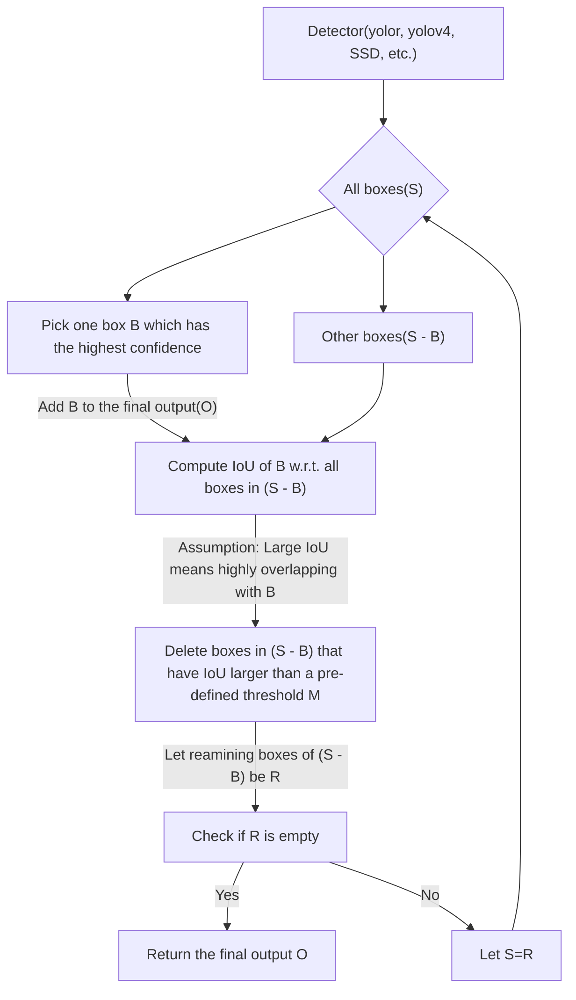

## Vallina Non-Maximum Suppression(NMS)
#### Assumption

> **Bounging boxes that highly overlap stand for the same object.**

That means objects will seperate enough in the images.

#### Method
Maunally define a threshold ``iou_thres=M``, ``0<=M<=1``.
> **Let ``A`` and ``B`` be two bounding boxes. ``IoU(A,B) >(=) M`` means ``A`` and ``B`` are highly overlapping.**

#### Pros and Cons
1. When the assumption is satisfied, NMS is **mostly** useful. Here are some scenarios that NMS is robust enough:
    - Satellite images: Ships, vehicles and buildings are almost impossible to overlap each other in this shooting angle.
    - Metal detector in customs.
    - Product counting on a conveyor belt.
    - Detect endanger species.
    - Detect illegal object.
    - Detect license plate in the entrence/exit of parking lot.

2. In reality, NMS can't fulfill most needs.
    - Crowd detections.
    - Car detections on the road/in the parking lot.
    - Product detections on a shelf.
    - Garbage detections.
    - Any targets that is easy to appear in group.
