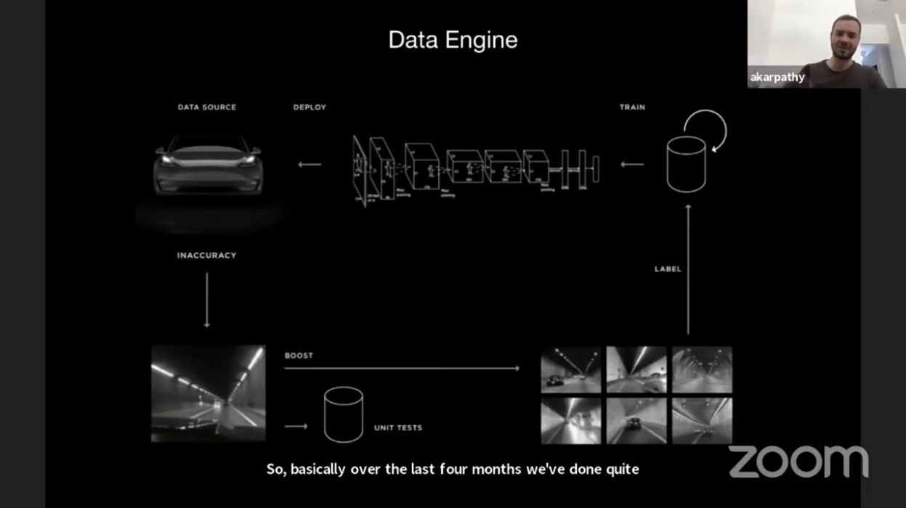

## Traditional Industry Method

- Expensive Lidar 
- Pre map the environment with Lidar sensor
- Create HD Map 
- Insert the lanes, the traffic lights and how they connect each lanes and where they are
- Localize in HD Map for testing

### Tesla's Method

- Vision based
- 8 cameras surround the cars(1280 x 960 x 3 @ 36fps)
- Detect lanes, traffic light, .etc when going to intersection
- When it comes to millions customers,  vision based is way more scalable than lidar based
- Vision based is way more difficult than lidar
- Need to construct neural network that function increadibly well based on the videos
- Once you solve this, it can be deploy anywhere on eatrh

### Vision Challenges

- Range finding, depth estimation, velocity estimation
- Are Neural networks able to do range finding or depth estimation of the objects? 
    - YES
- Most of the times, radar can give you increadibly accurate depth and velocity measurement
    - But radar is easy to give noises in lots of accident cases

## Solution: Use a neural network that predict depth and accleration directly

    

- Begin from top-right corner. Use a seed data set and train a neural network.
- Deploy network to customer's car in shadow mode and sliently make predictions
- Use *some mechanism* for sourcing inaccuracies
- Get one of the triggers below to know the scenario where the network may misbehaving.
    * Radar vision mismatch
    * Bounding box jitter
    * Detection flicker
    * Detection in Main camera but not Narrow camera
    * Driver didn't break but tracker thinks CIPV(closet in-path vehicle) is rapidly decelerating
    * Break lights are detected as on but accleration is positive
    * Rarely high/low velocity or accleration
    * CIPV cuts in/cuts out
    * CIPV has high lateral velocity
    * Bounding-box derived depth disagrees with network-predicted depth
    * Rarely sloping road surface (hillcrest or dip)
    * Driver breaks sharply on the highway
    * Stop and go traffic
    * Main or Narrow or both cameras appear to be blinded
    * Driver enters/exits tunnel
    * Objects on the roof (e.g. canoes)
    * Driver breaks harshly and there is a VRU(vulnerabel road user) cloys to us but there is no intersection
    * Motorcycle on the highway at night
    * Vehicle type of CIPV filcker between different classes
    ...etc.
- There are totally 221 triggers that need to be developed and maintained
- Clips are incorporating into training data by autolabeling tool
    - Large, slow, non-deployable but accurate network to auto label
    - Need to lable well in adversarial scenario like debris, dust cloud, heavy snow
- Data cleaning the training set
- Then loop over and over again
- Spend roughly 4 months of really just focusing on a lot of teams on achiving really good at depth, velocity and accleration

## Final Dataset

- 1 million (8 cameras of 36fps, 10-second videos)
- 6 billion object labels with accurate depth/velocity
- 1.5 petabytes totally
    
## References
[Youtube Video](https://www.youtube.com/watch?v=NSDTZQdo6H8)
