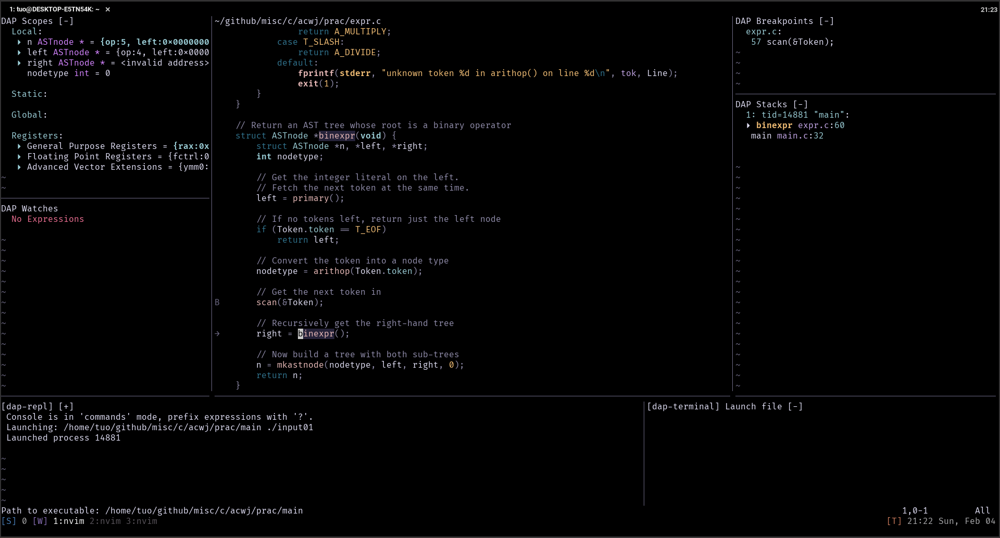

Part of this readme was generated by [Dotfyle](https://dotfyle.com)

Plugins
-------

### plugin-manager

+ [folke/lazy.nvim](https://dotfyle.com/plugins/folke/lazy.nvim)

### ui

+ [luukvbaal/statuscol.nvim](https://dotfyle.com/plugins/luukvbaal/statuscol.nvim)
+ [rose-pine/neovim](https://dotfyle.com/plugins/rose-pine/neovim)
+ [j-hui/fidget.nvim](https://dotfyle.com/plugins/j-hui/fidget.nvim)
+ [folke/trouble.nvim](https://dotfyle.com/plugins/folke/trouble.nvim)
+ [norcalli/nvim-colorizer.lua](https://github.com/norcalli/nvim-colorizer.lua)
+ [lukas-reineke/indent-blankline.nvim](https://dotfyle.com/plugins/lukas-reineke/indent-blankline.nvim)
+ [folke/todo-comments.nvim](https://dotfyle.com/plugins/folke/todo-comments.nvim)
+ [folke/twilight.nvim](https://dotfyle.com/plugins/folke/twilight.nvim)
+ [folke/zen-mode.nvim](https://dotfyle.com/plugins/folke/zen-mode.nvim)

### lsp

+ [neovim/nvim-lspconfig](https://dotfyle.com/plugins/neovim/nvim-lspconfig)
+ [mfussenegger/nvim-lint](https://dotfyle.com/plugins/mfussenegger/nvim-lint)
+ [stevearc/aerial.nvim](https://dotfyle.com/plugins/stevearc/aerial.nvim)
+ [williamboman/mason.nvim](https://dotfyle.com/plugins/williamboman/mason.nvim)
    + [williamboman/mason-lspconfig.nvim](https://github.com/williamboman/mason-lspconfig.nvim)
    + [WhoIsSethDaniel/mason-tool-installer.nvim](https://github.com/WhoIsSethDaniel/mason-tool-installer.nvim)
+ [microsoft/python-type-stubs](https://github.com/microsoft/python-type-stubs)

### debugging

+ [mfussenegger/nvim-dap](https://dotfyle.com/plugins/mfussenegger/nvim-dap)
    + [rcarriga/nvim-dap-ui](https://dotfyle.com/plugins/rcarriga/nvim-dap-ui)

### editing-support

+ [RRethy/vim-illuminate](https://dotfyle.com/plugins/RRethy/vim-illuminate)
+ [danymat/neogen](https://dotfyle.com/plugins/danymat/neogen)
+ [numToStr/Comment.nvim](https://dotfyle.com/plugins/numToStr/Comment.nvim)
+ [stevearc/conform.nvim](https://dotfyle.com/plugins/stevearc/conform.nvim)
+ [backdround/neowords.nvim](https://dotfyle.com/plugins/backdround/neowords.nvim)
+ [L3MON4D3/LuaSnip](https://dotfyle.com/plugins/L3MON4D3/LuaSnip)
+ [kylechui/nvim-surround](https://dotfyle.com/plugins/kylechui/nvim-surround)
+ [hrsh7th/nvim-cmp](https://dotfyle.com/plugins/hrsh7th/nvim-cmp)
    + [hrsh7th/cmp-buffer](https://github.com/hrsh7th/cmp-buffer)
    + [FelipeLema/cmp-async-path](https://codeberg.org/FelipeLema/cmp-async-path)
    + [saadparwaiz1/cmp_luasnip](https://github.com/saadparwaiz1/cmp_luasnip)
    + [hrsh7th/cmp-nvim-lsp-signature-help](https://github.com/hrsh7th/cmp-nvim-lsp-signature-help)
    + [hrsh7th/cmp-nvim-lsp](https://github.com/hrsh7th/cmp-nvim-lsp)
    + [hrsh7th/cmp-nvim-lua](https://github.com/hrsh7th/cmp-nvim-lua)
    + [micangl/cmp-vimtex](https://dotfyle.com/plugins/micangl/cmp-vimtex)
+ [nvim-treesitter/nvim-treesitter](https://dotfyle.com/plugins/nvim-treesitter/nvim-treesitter)
    + [andymass/vim-matchup](https://github.com/andymass/vim-matchup)
    + [Wansmer/treesj](https://dotfyle.com/plugins/Wansmer/treesj)
    + [nvim-treesitter/nvim-treesitter-textobjects](https://dotfyle.com/plugins/nvim-treesitter/nvim-treesitter-textobjects)
    + [nvim-treesitter/nvim-treesitter-context](https://dotfyle.com/plugins/nvim-treesitter/nvim-treesitter-context)
    + [nvim-treesitter/playground](https://github.com/nvim-treesitter/playground)
+ [tpope/vim-vinegar](https://github.com/tpope/vim-vinegar)
+ [nvim-telescope/telescope.nvim](https://dotfyle.com/plugins/nvim-telescope/telescope.nvim)
    + [debugloop/telescope-undo.nvim](https://dotfyle.com/plugins/debugloop/telescope-undo.nvim)
    + [crispgm/telescope-heading.nvim](https://github.com/crispgm/telescope-heading.nvim)
    + [nvim-telescope/telescope-fzf-native.nvim](https://github.com/nvim-telescope/telescope-fzf-native.nvim)
+ [ThePrimeagen/harpoon](https://dotfyle.com/plugins/ThePrimeagen/harpoon)

### git

+ [tpope/vim-fugitive](https://github.com/tpope/vim-fugitive)
+ [lewis6991/gitsigns.nvim](https://dotfyle.com/plugins/lewis6991/gitsigns.nvim)

### markdown-and-latex

+ [lervag/vimtex](https://github.com/lervag/vimtex)
+ [iamcco/markdown-preview.nvim](https://dotfyle.com/plugins/iamcco/markdown-preview.nvim)

### nvim-dev

+ [folke/neodev.nvim](https://dotfyle.com/plugins/folke/neodev.nvim)
+ [nvim-lua/plenary.nvim](https://dotfyle.com/plugins/nvim-lua/plenary.nvim)
