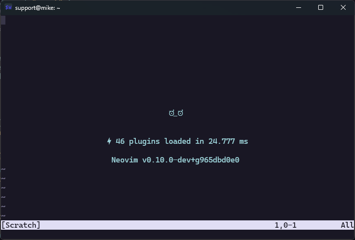
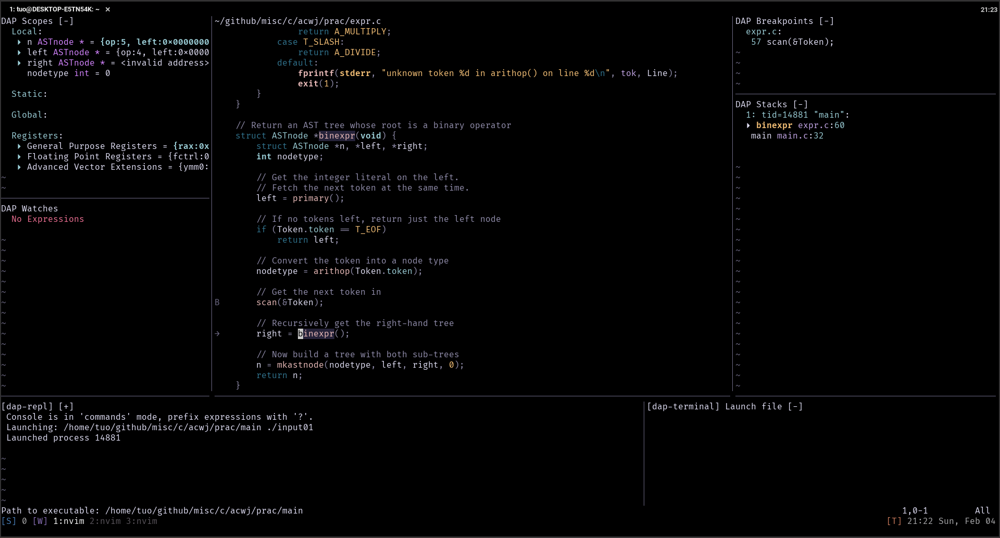

<a href="https://dotfyle.com/youngtuotuo/dotfiles-nvim"></a>
<a href="https://dotfyle.com/youngtuotuo/dotfiles-nvim"></a>

Part of this readme was generated by [Dotfyle](https://dotfyle.com)


Neovim
------

c/c++ develop with python extension
-----------------------------------

To resolve `#include <Python.h>`, run the following command to get the path of `Python.h`

```console
python -c "import sysconfig; print(sysconfig.get_paths()['include'])"
# or
python3 -c "import sysconfig; print(sysconfig.get_paths()['include'])"
# or
pkg-config --libs --cflags python
# or
pkg-config --libs --cflags python3
```

, and, add

```
-I/path/to/Python.h
```

into your `compile_commands.json`.


Plugins
-------

### plugin-manager

+ [folke/lazy.nvim](https://dotfyle.com/plugins/folke/lazy.nvim)

### lsp

+ [neovim/nvim-lspconfig](https://dotfyle.com/plugins/neovim/nvim-lspconfig)
+ [stevearc/aerial.nvim](https://dotfyle.com/plugins/stevearc/aerial.nvim)
+ [williamboman/mason.nvim](https://dotfyle.com/plugins/williamboman/mason.nvim)
    + [williamboman/mason-lspconfig.nvim](https://github.com/williamboman/mason-lspconfig.nvim)
    + [WhoIsSethDaniel/mason-tool-installer.nvim](https://github.com/WhoIsSethDaniel/mason-tool-installer.nvim)

### debugging

+ [mfussenegger/nvim-dap](https://dotfyle.com/plugins/mfussenegger/nvim-dap)
    + [rcarriga/nvim-dap-ui](https://dotfyle.com/plugins/rcarriga/nvim-dap-ui)

### editing-support

+ [numToStr/Comment.nvim](https://dotfyle.com/plugins/numToStr/Comment.nvim)
+ [L3MON4D3/LuaSnip](https://dotfyle.com/plugins/L3MON4D3/LuaSnip)
+ [kylechui/nvim-surround](https://dotfyle.com/plugins/kylechui/nvim-surround)
+ [nvim-treesitter/nvim-treesitter](https://dotfyle.com/plugins/nvim-treesitter/nvim-treesitter)
    + [nvim-treesitter/nvim-treesitter-textobjects](https://dotfyle.com/plugins/nvim-treesitter/nvim-treesitter-textobjects)
+ [tpope/vim-vinegar](https://github.com/tpope/vim-vinegar)
+ [nvim-telescope/telescope.nvim](https://dotfyle.com/plugins/nvim-telescope/telescope.nvim)
    + [nvim-telescope/telescope-fzf-native.nvim](https://github.com/nvim-telescope/telescope-fzf-native.nvim)

### git

+ [tpope/vim-fugitive](https://github.com/tpope/vim-fugitive)

### markdown-and-latex

+ [lervag/vimtex](https://github.com/lervag/vimtex)
+ [iamcco/markdown-preview.nvim](https://dotfyle.com/plugins/iamcco/markdown-preview.nvim)

### nvim-dev

+ [nvim-lua/plenary.nvim](https://dotfyle.com/plugins/nvim-lua/plenary.nvim)
