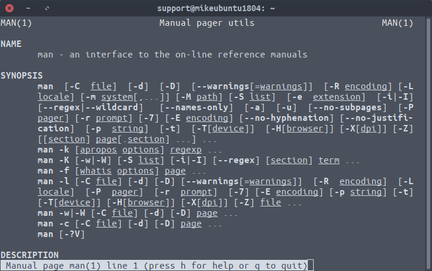
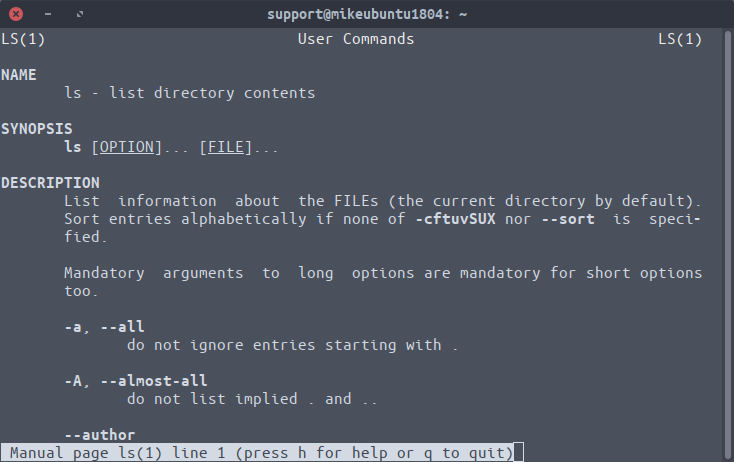

# Basic manual page structure

`$ man man`
        Spelling out, in great detail, how the man pages are laid out and organized

    

`$ man ls`

    

`LS(1)`
        1 means this man page is in `section 1`. There are 9 sections:
|Section|Usage|
|:-------|:-----|
|1       |Shell commands and applications|
|2       |Basic kernel services - system calls and error codes|
|3       |Library information for programmers|
|4       |Network services - if TCP/IP or NFS is intalled device drivers and network protocols|
|5       |Standard file formats - for examples: shows what a *tar* archive looks like|
|6       |Games|
|7       |Miscellaneous files and documents|
|8       |System administraction and maintenance commands|
|9       |Obscure kernel specs and interfaces|

There's another thing called section, also. They're the bold titles you see at first glance. Each pages consists fo several titles, they may vary from vendor to vendor, but they will be similar. The general breakdown is as follows:

|Section|Usage|
|:-------|:-----|
|**NAME**|The command name and a brief description of the command|
|**SYNOPSIS**|Shows how the command is used. Arguments in the square brackets [] are optional|
|**DESCRIPTION**|Describes the command to what is does and how you can use it|
|**EXAMPLES**|Examples of how the command can be used|
|**DIAGNOSTIC**|Lists status or error messages returned by the command|
|**FILES**|Contains a lists of supplementary files used by UNIX to run this specific command|
|**LIMITS**|Describes any limitations of a command.|
|**PORTABILITY**|Lists other systems where a command is abailable, along with other versions fo the utility may differ|
|**SEE ALSO**|Lists related man pages that contain relevant information|
|**HISTORY**|Gives a brief history of the command such as when it first appeared|
|**WARNING**|Contains important advice for users|
|**NOTES**|Not as severe as warning, but important information|

`$ man 1 ls`
        Will only show section 1 of `ls` command.

`$ man -k ls`
        Will show lists of man pages that deal with `ls` command

`$ whatis passwd`
        To know what section that `passwd`'s manual page contains

`$ man -f passwd`
        The same as above

`$ whereis cal`
        Tell you where the program is and where the man page resides

`$ man -w cal`
        Can also know where the man page is

`whereis` is `PATH` dependent, it can only tell you where files are if they are in `PATH` environment

## References
[It's foss](https://itsfoss.com//linux-man-page-guide)
