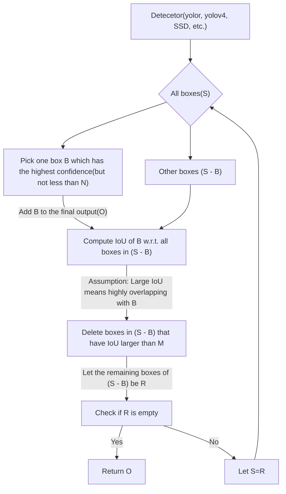

```mermaid
    graph TD
        A["Detecetor(yolor, yolov4, SSD, etc.)"] --> B{"All boxes(S)"}
        B --> C["Pick one box B which has the highest confidence(but not less than N)"]
        B --> D["Other boxes (S - B)"]
        C --> |"Add B to the final output(O)"|E["Compute IoU of B w.r.t. all boxes in (S - B)"]
        D --> E
        E --> |Assumption: Large IoU means highly overlapping with B|F["Delete boxes in (S - B) that have IoU larger than M"]
        F --> |"Let the remaining boxes of (S - B) be R"|G[Check if R is empty]
        G --> |Yes|H[Return O]
        G --> |No|I[Let S=R]
        I --> B
```
